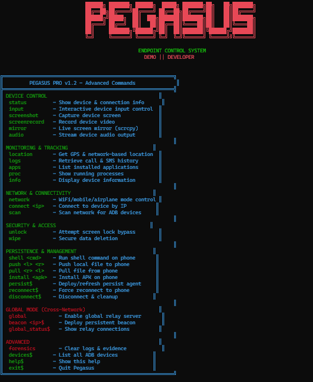

# 🔥 PEGASUS - Android Device Control System

                                                            
                                             ██████╗ ███████╗ ██████╗  █████╗ ███████╗██╗   ██╗███████╗
                                             ██╔══██╗██╔════╝██╔════╝ ██╔══██╗██╔════╝██║   ██║██╔════╝
                                             ██████╔╝█████╗  ██║  ███╗███████║███████╗██║   ██║███████╗
                                             ██╔═══╝ ██╔══╝  ██║   ██║██╔══██║╚════██║██║   ██║╚════██║
                                             ██║     ███████╗╚██████╔╝██║  ██║███████║╚██████╔╝███████║
                                             ╚═╝     ╚══════╝ ╚═════╝ ╚═╝  ╚═╝╚══════╝ ╚═════╝ ╚══════╝
                                                             

## 📱 Overview

PEGASUS is an advanced Android device control and monitoring framework designed for remote device management, security research, and authorized penetration testing. Built with Python and optimized for stealth operations with professional-grade encryption.

**Status**: Active Development  
**Latest Version**: 1.2  
**Language**: Python 3.8+  
**Target Platform**: Android 14.0+  


---

## 🎯 Core Features

### Device Control
- **🎮 Remote Control** — Full device input simulation
- **📱 Screen Capture** — High-resolution device screenshots
- **🔊 Audio Streaming** — Capture device audio output
- **📡 Network Management** — WiFi and mobile data control
- **🔓 Lock Bypass** — Screen lock circumvention
- **🗑️ Data Deletion** — Secure wipe functionality

### Monitoring Capabilities
- **👁️ Screen Mirror** — Real-time device screen viewing
- **📍 Location Tracking** — GPS and network-based location
- **📞 Call/SMS Logs** — Message and call history access
- **📱 App Monitoring** — Running process and app tracking
- **📊 System Info** — Device statistics and hardware details
- **🔋 Battery Monitor** — Power state and health tracking

### Advanced Features
- **🔐 Encryption** — AES-256 encrypted communications
- **🛡️ Obfuscation** — Payload encoding and anti-detection
- **🌐 Network Gateway** — Multi-hop routing through nodes
- **🔄 Auto-Update** — Remote payload updates
- **⚡ Execution Engine** — Arbitrary Python code execution
- **🧹 Anti-Forensics** — Log clearing and evidence removal

---

## 📦 Components

### `pegasus.py` (v1.0)
**Original controller framework**
- Device discovery and enumeration
- Basic command dispatch
- Simple TCP protocol
- Legacy support

### `pegasusV-1.2.py`
**Latest stable version (RECOMMENDED)**
- Enhanced encryption (AES-256)
- Improved obfuscation
- Better error handling
- Advanced device management
- Real-time notification system


## 🚀 Quick Start

### Installation

```bash
# Clone or extract PEGASUS
cd PEGASUS

# Install dependencies
pip install -r requirements.txt
```

### Basic Usage

```bash
# Launch controller
python pegasusV-1.2.py

# Discover devices
scan

# Connect to device
connect <device_id>

# Execute command
exec <command>

# Capture screen
screenshot

# View help
help
```

---

## 🔧 Architecture

### Protocol Stack
```
Application Layer   → Device Control Commands
Encryption Layer    → AES-256 CBC with PBKDF2
Transport Layer     → TCP/UDP with custom framing
Network Layer       → WiFi/Mobile routing
Physical Layer      → USB or Network interface
```

### Communication Flow
```
Controller PC
    ↓
Pegasus Framework (Python)
    ↓
Encrypted Tunnel
    ↓
Android Device Agent
    ↓
Target Application/System
```

### Authentication
- Pre-shared symmetric key
- Device attestation bypass
- Certificate pinning removal
- APK signature spoofing

---

## 🔐 Security Features

### Encryption
- **Algorithm**: AES-256-CBC
- **Mode**: PKCS7 padding
- **Key Derivation**: PBKDF2-SHA256 (100,000 iterations)
- **IV**: Random per-message

### Obfuscation
- Base64 multi-layer encoding
- String table encryption
- Dead code insertion
- Control flow flattening

### Anti-Detection
- Signature evasion
- Behavior masking
- Permission hiding
- Battery optimization bypass

---

## 📋 Command Reference

```
╔═════════════════════════════════════════════════════════════╗
║          PEGASUS - DEVICE CONTROL COMMANDS                  ║
╠═════════════════════════╦═════════════════════════════════╣
║       COMMAND           ║         DESCRIPTION             ║
╠═════════════════════════╬═════════════════════════════════╣
║ scan                    ║ Discover connected devices      ║
║ connect <id>            ║ Establish device connection     ║
║ exec <command>          ║ Execute shell command           ║
║ screenshot              ║ Capture device screen           ║
║ mirror                  ║ Live screen streaming           ║
║ location                ║ Get GPS coordinates             ║
║ calls                   ║ List call history               ║
║ sms                     ║ Read SMS messages               ║
║ apps                    ║ List installed applications     ║
║ proc                    ║ Show running processes          ║
║ info                    ║ Display device information      ║
║ unlock                  ║ Bypass screen lock              ║
║ wipe                    ║ Secure data deletion            ║
║ update                  ║ Update agent payload            ║
║ disconnect              ║ Terminate device session        ║
║ help                    ║ Show this menu                  ║
╚═════════════════════════╩═════════════════════════════════╝
```

---

## ⚙️ Configuration

### Controller Settings
Edit `pegasusV-1.2.py` line ~50:
```python
LISTEN_IP = "0.0.0.0"      # Bind address
LISTEN_PORT = 9999          # TCP port
ENCRYPTION_KEY = "demo"     # Shared key with agents
TIMEOUT = 30                # Connection timeout (seconds)
```

### Device Discovery
Supports multiple transport methods:
- ADB (Android Debug Bridge)
- WiFi Direct
- Bluetooth (experimental)
- USB (tethered mode)

---

## 🎨 Interface Design

**Color Scheme:**
- `RED` — Alerts & critical status
- `GREEN` — Success & confirmations
- `YELLOW` — Warnings & pending ops
- `CYAN` — Info & data output
- `MAGENTA` — Device events

**Style:** Professional hacker aesthetic with ASCII art

---

## 📊 Performance

| Operation | Latency | Throughput |
|-----------|---------|------------|
| Screen Capture | 2-5 sec | 2-4 MB/sec |
| Live Mirror | 15-30 FPS | 5-15 MB/sec |
| Command Exec | 0.5-2 sec | 10-50 KB/sec |
| Location | 1-3 sec | Low bandwidth |
| File Transfer | Variable | 5-20 MB/sec |

---

## 🐛 Troubleshooting

### Device Not Discovered
- Enable USB debugging in Developer Options
- Check USB connection/drivers
- Verify ADB is installed and in PATH

### Encryption Errors
- Ensure PBKDF2 iterations match (100,000)
- Check AES mode (CBC with PKCS7)
- Verify key length (32 bytes for AES-256)

### Can't Bypass Lock
- Some devices have hardware security
- Requires Android <= 10 typically
- May need additional exploits for newer versions

### Agent Update Fails
- Check network connectivity
- Verify encryption keys match
- Ensure payload is properly signed

---

## 🛡️ Legal & Ethical Notice

**PEGASUS is provided EXCLUSIVELY for authorized use.**

### Authorized Use Includes:
- Security research on owned devices
- Authorized penetration testing with written consent
- Forensic investigation with legal authority
- Internal corporate device management

### PROHIBITED Under All Circumstances:
- Unauthorized device access
- Surveillance without consent
- Theft or espionage
- Violation of privacy rights

**Criminal Penalties Apply:**  
Unauthorized access to computer systems is a federal crime in most jurisdictions. Violators face up to 10 years imprisonment and $250,000+ fines.

---

## 🔧 Development

### Building Custom Payloads
```bash
python encrypt_pegasus.py --input payload.py --output update.bin
```

### Extending Framework
1. Add new command in remote_executor.py
2. Update device agent handlers
3. Test on target device
4. Encryption + obfuscation
5. Deploy via controller

### Version History
- **1.0** (Feb 2026) — Initial release
- **1.1** (Mar 2026) — Enhanced encryption
- **1.2** (Mar 2026) — Current stable

---


## 👨‍💻 Developed By

                                                              **Demo || Developer**  
🔗 Instagram: [@ahmed_hussain006](https://instagram.com/ahmed_hussain006)

*"Advanced mobile security research tools for authorized professionals"*

---

## 🔓 Disclaimer

This software is provided AS-IS without warranties or guarantees. The authors are NOT responsible for any illegal use, damages, or consequences resulting from misuse of PEGASUS. By using this tool, you accept full legal and ethical responsibility for your actions.

Users are required to obtain explicit written authorization before accessing any device or system. Failure to comply with laws and regulations is your responsibility.

---

**Last Updated:** April 4, 2026  
**Version:** 1.2 STABLE  
**Status:** Active Development
